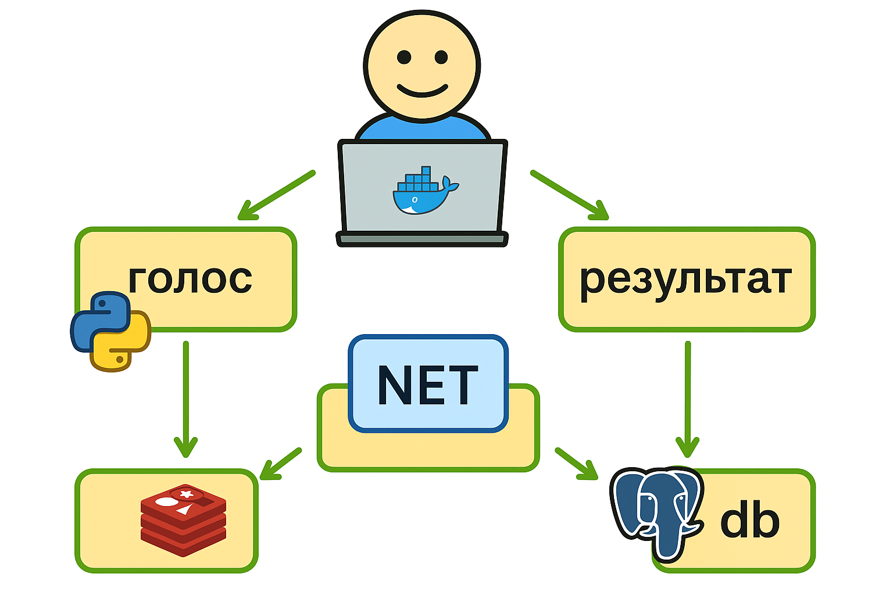

# 🗳️ Приложение для голосования [](https://www.docker.com) [](https://docs.docker.com/compose/)

Специально для Романа Рашидовича, апп, на который у меня ушло 7 часов, шоколадка ритерспорт и две банки редбулла, которые как раз мы будем сравнивать с помощью него.
Старался сделать максимально простым для поднятия без окружения, используем только докер и буквально одну команду.

Многоконтейнерное приложение для голосования с микросервисной архитектурой, реализованное на Python, .NET, Node.js и Redis/PostgreSQL.


## 🚀 Быстрый старт

### 📋 Предварительные требования
- 🐳 [Docker](https://docs.docker.com/get-docker/)
- 🎼 [Docker Compose](https://docs.docker.com/compose/install/)

### 🛠️ Запуск приложения

# 1. Клонируйте репозиторий
```bash
git clone https://github.com/nev3r17/nev3rvoting)
cd nev3rvoting
```
# 2. Запустите контейнеры

```bash
docker-compose up -d --build
```

🌐 Доступ к приложениям

Сервис	URL
Голосование	🖥️ http://localhost:8080
Результаты	📊 http://localhost:8081



🔧 Компоненты системы

Фронтенд-веб-приложение на Python (/vote), позволяющее голосовать между двумя вариантами

Redis (https://hub.docker.com/_/redis/), собирающий новые голоса

.NET-воркер (/worker/), который обрабатывает голоса и сохраняет их в…

Postgres (https://hub.docker.com/_/postgres/) с Docker volume для хранения данных

Веб-приложение на Node.js (/result), показывающее результаты голосования в реальном времени


⚙️ Особенности реализации

🐳 Docker-контейнеризация всех компонентов

🔄 Асинхронная обработка через Redis

💾 Сохранение состояния в PostgreSQL

📈 Real-time обновление результатов
